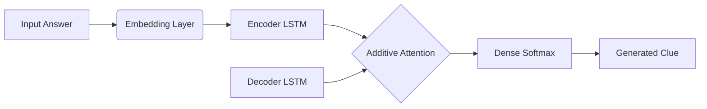
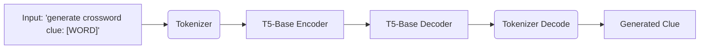

# NYTimes Crossword Hint Generator

## Project Overview
This project aims to build an AI chatbot capable of generating New York Times-style crossword clues when provided with an answer word. It explores multiple natural language processing approaches to achieve this:

*   **Model 1:** A custom Seq2Seq model built from scratch using Keras, featuring LSTMs, Embeddings, and an Additive Attention mechanism. It is trained on a combination of NYT crossword data and Princeton WordNet definitions.
*   **Model 2 & 3:** Fine-tuned pre-trained Transformer models (T5-small and T5-base) using the Hugging Face `transformers` library. These models are trained on NYT crossword clues, WordNet definitions, and synthetic data to capture the nuanced "crossword voice." They utilize advanced generation techniques like beam search, nucleus sampling, and repetition penalties to improve the quality of the generated clues.

## System Architecture

### Model 1: Custom Seq2Seq with Attention

### Model 3: Fine-Tuned T5-Base

## Technologies Used
*   **Programming Language:** Python
*   **Deep Learning Frameworks:** TensorFlow/Keras (Model 1), PyTorch (Model 2 & 3)
*   **Libraries:** Hugging Face `transformers` and `datasets`, `pandas`, `numpy`, `evaluate` (ROUGE metrics)
*   **Environment:** Google Colab (with T4 GPU acceleration)

## How to Use in Google Colab

1.  **Environment Setup:** Ensure your Colab runtime has a GPU enabled (Runtime > Change runtime type > T4 GPU) to significantly speed up the training of the T5 models.
2.  **Upload Datasets:** You must upload the required datasets into your Colab environment's file system for the training scripts to work. These include:
    *   `nytimes_crossword_clues_kaggle.txt`
    *   `wordnet_core_word_senses_princeton.txt`
    *   `chatgpt_synthetic_hints_updated.csv`
3.  **Run Dependencies:** Execute the initial cells to install required libraries like `transformers`, `datasets`, and `evaluate`.
4.  **Execute Models:** You can run the models sequentially or skip to Model 3 for the best results.
5.  **Google Drive Integration:** Model 3 saves the fine-tuned model to your Google Drive (`/content/drive/MyDrive/NLP_Crossword_Project/t5_final_model`). Make sure to grant Colab access to your Drive when prompted.
6.  **Interactive Chat:** Run the cell containing `start_clue_generator()` to interact with the trained T5 model in real-time. Type an answer word, and the model will return a crossword clue.
7.  **Export to PDF:** The final cell installs LaTeX dependencies and uses `nbconvert` to export your entire notebook into a formatted PDF document.
